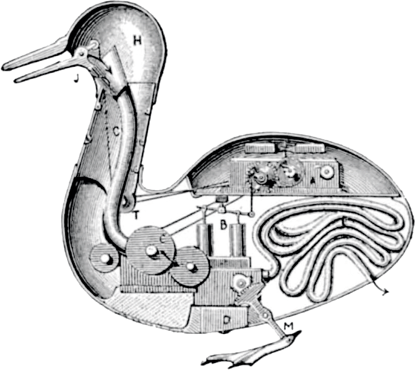

# automaton-build

Automaton build library streamlines the creation, development, testing, and publishing of the automaton projects.

 

> If every tool, when ordered, or even of its own accord, could do the work that befits it, just as the creations of Daedalus moved of themselves, or the tripods of Hephaestus went of their own accord to their sacred work, if the shuttle would weave and the plectrum touch the lyre without a hand to guide them, master-craftsmen would have no need of assistants and masters no need of slaves ~ Aristotle, Politics 1253b

## Motivation

To meet monorepo objectives, it should be possible to quickly create a project and maintain its modifications through time.

At the same moment, it is really complicated and most often dangerous to decide for once how all projects should look like.

So, all factorized code is stored in the `automaton-build` project.

## Design decision

See [design decision page](docs/design_decision.md)

## Quick start

To integrate `automaton-build` into your project:

1. Create `bb.edn` file at the root of your project with the following content:

``` clojure
{:deps {org.clojars.hephaistox/automaton-build #:mvn{:version "1.0.2"}} 
:tasks {-base-deps {:doc "Dependencies for a task using bb"}
        :requires [[automaton-build.tasks.common :as tasks-common]]}}
```

Which will:
* Add the `automaton-build` library dependency to enable its features.
* Add the `-base-deps` task to declare whatever is common to all tasks. It starts with `-` so it is not shown in the task list.
* Add the `requires` that enables `tasks-common` namespace for all tasks so you don't have to repeat it.

2. Add your custom tasks or use pre-defined ones from the `automaton-build.tasks` directory.

Example task for starting REPL:
```clojure
 repl {:depends [-base-deps]
       :requires [[automaton-build.tasks.2 :as tasks-2]]
       :extra-deps {}
       :doc "Launch repl"
       :enter (tasks-common/enter tasks-2/cli-opts (current-task))
       :task (tasks-2/start-repl [:common-test :env-development-repl :build])}
```

## Tasks configuration

Some tasks may require additional configuration. Set up a `project.edn` file in your project root to customize task behavior. For an example refer to the forbidden-words report task [automaton-build.tasks.tasks.3](src/bb/automaton_build/tasks/3.clj) and [project.edn file](project.edn) 


[For detailed API documentation click here](https://hephaistox.github.io/automaton-build/latest).

License information can be found in [LICENSE file](LICENSE.md)
Copyright © 2020-2024 Hephaistox
